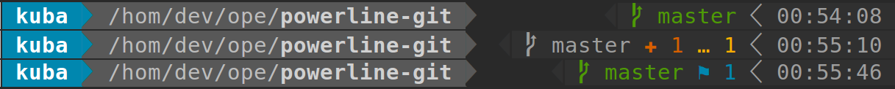

Powerline Gitstatus theme
===
This is theme for the [Powerline](https://github.com/powerline/powerline) project including [Gitstatus](https://github.com/jaspernbrouwer/powerline-gitstatus) segment

1. To install above projects just invoke:
  - dnf install powerline
  - pip install powerline-gitstatus
2. To activate theme just copy the ```powerline``` into your ```~/.config``` directory and enjoy


